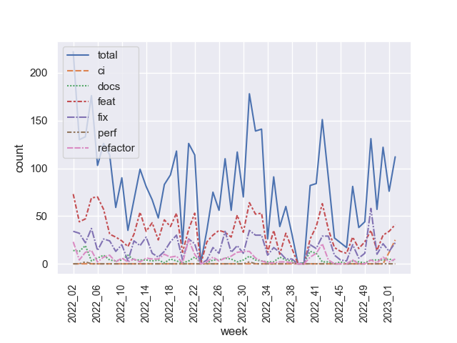
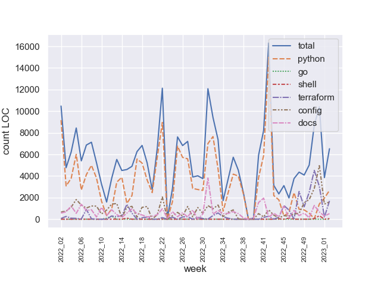
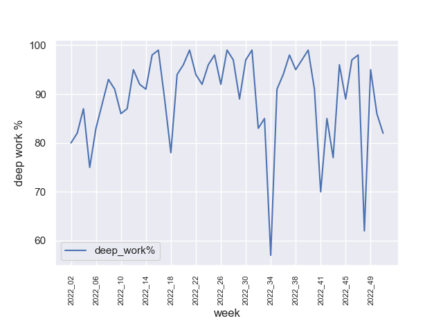

# Espen Albert

## Key metrics
<!-- KEY-METRICS:START -->
Key Metrics dumped @ `2023_03`

Metric | Total | Δ 52w | Δ 13w | Δ 1w
--- | --- | --- | --- | ---
break% | 4.93 | 4.71 | 4.77 | 3
commit_features | 1820 | 1656 | 361 | 41
commit_fixes | 953 | 865 | 235 | 22
commit_total | 4465 | 3980 | 968 | 112
config_add | 34428 | 32662 | 11161 | 1240
config_del | 13702 | 12933 | 5986 | 359
deep_life% | 56.64 | 58.77 | 78.69 | 90
deep_work% | 82.96 | 82.96 | 86.69 | 82
design_spec | 10 | 7 | 2 | 0
dockerfile | 38 | 33 | 3 | 0
docs_add | 26006 | 24523 | 6051 | 435
docs_del | 8570 | 7579 | 840 | 81
go_add | 274 | 274 | 0 | 0
go_del | 99 | 99 | 0 | 0
helm_chart | 36 | 30 | 6 | 0
life_days | 189 | 177 | 50 | 7
life_hours | 306.27 | 293.24 | 106.69 | 23.62
overtime | 317.51 | 271.24 | 56.22 | 0.67
public_holidays | 11 | 11 | 2 | 0
pypi_package | 92 | 29 | 0 | 0
python_add | 131959 | 120180 | 22427 | 2244
python_del | 52630 | 48371 | 8336 | 419
python_package | 36 | 28 | 12 | 1
shell_add | 522 | 522 | 424 | 46
shell_del | 134 | 134 | 134 | 6
terraform_add | 18238 | 17930 | 12386 | 987
terraform_del | 6979 | 6869 | 5831 | 705
terraform_module | 53 | 51 | 29 | 2
uml_diagram | 32 | 32 | 9 | 0
vacation_days | 27 | 27 | 0 | 0
work_days | 259 | 242 | 69 | 5
work_hours | 2039.62 | 1936.26 | 536.19 | 38.18

<!-- KEY-METRICS:END -->
- `pypi_package` are 3rd party packages used, see list in [requirements.txt](./requirements.txt)
- `python_package` are local packages I have created
- any metric named `*_add/del` are LoC (Lines of Code)
- break% is `break_time` / `total_hours`, where break_time is going to the bathroom, pomodoro break, quick snack, coffee, etc.
- deep_{life/work}% are inspired by [Cal Newport](https://www.calnewport.com/) where I track time either as _deep_ (focused work, e.g., coding, design writing, research, etc.) or _shallow_ (virtual meeting with many participants, slack chats, email replying, etc.)
- overtime is whatever `work_hours - 7.5` per day and aggregated per Δ week

## Commit count

## LoC (Lines of Code)

## Deep work
- filtered out where deep% > 0

