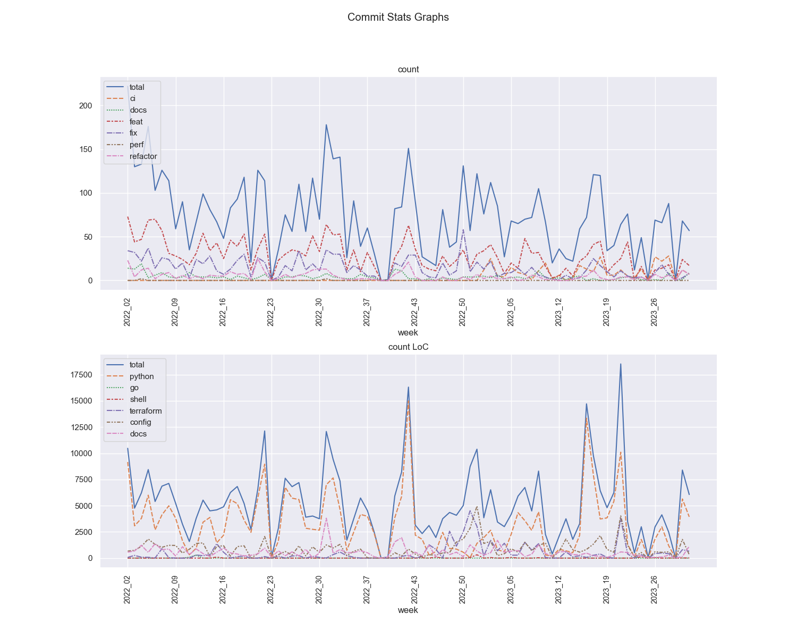

# Espen Albert

## Key metrics
<!-- KEY-METRICS:START -->
Key Metrics dumped @ `2023-01-27T17-13Z`

### Commits

Metric | Total | Δ 52w | Δ 13w | Δ 1w
--- | --- | --- | --- | ---
commit_features | 1843 | 1610 | 321 | 23
commit_fixes | 957 | 832 | 210 | 4
commit_total | 4545 | 3884 | 897 | 80

- Based on [Angular Commit message guideline](https://github.com/angular/angular/blob/main/CONTRIBUTING.md#-commit-message-guidelines)

### Days/hours worked

Metric | Total | Δ 52w | Δ 13w | Δ 1w
--- | --- | --- | --- | ---
break% | 4.89 | 4.67 | 4.46 | 3
deep_life% | 57.41 | 60.02 | 81.77 | 100
deep_work% | 82.62 | 82.75 | 84 | 64
life_days | 191 | 173 | 51 | 2
life_hours | 309.29 | 294.06 | 107.22 | 3.02
overtime | 318.41 | 256.99 | 44.75 | 0.9
public_holidays | 11 | 11 | 2 | 0
vacation_days | 27 | 27 | 0 | 0
work_days | 264 | 242 | 68 | 5
work_hours | 2078.01 | 1921.99 | 524.72 | 38.39

- break% is `break_time` / `total_hours`, where break_time is going to the bathroom, pomodoro break, quick snack, coffee, etc.
- deep_{life/work}% are inspired by [Cal Newport](https://www.calnewport.com/) where I track time either as _deep_ (focused work, e.g., coding, design writing, research, etc.) or _shallow_ (virtual meeting with many participants, slack chats, email replying, etc.)
- overtime is whatever `work_hours - 7.5` per day and aggregated per Δ week
- life_hours are side projects involving coding
- life_days are days where life_hours > 0

### LoC - Lines of Code deleted/added

Metric | Total | Δ 52w | Δ 13w | Δ 1w
--- | --- | --- | --- | ---
config_add | 34669 | 31766 | 11225 | 241
config_del | 13708 | 12256 | 5305 | 6
docs_add | 27099 | 25158 | 6977 | 1093
docs_del | 8821 | 7744 | 1081 | 251
go_add | 274 | 274 | 0 | 0
go_del | 99 | 99 | 0 | 0
python_add | 132538 | 117502 | 13451 | 579
python_del | 52797 | 45791 | 3063 | 167
shell_add | 522 | 522 | 424 | 0
shell_del | 134 | 134 | 134 | 0
terraform_add | 18802 | 18438 | 12916 | 564
terraform_del | 7110 | 6979 | 5721 | 131

- python is for files ending in: ".py",".pyi"
- go is for files ending in: ".go"
- shell is for files ending in: ".sh"
- terraform is for files ending in: ".tf"
- config is for files ending in: ".yml",".yaml",".json",".hcl",".tfvars"
- docs is for files ending in: ".md",".rst"

### Other Metrics

Metric | Total | Δ 52w | Δ 13w | Δ 1w
--- | --- | --- | --- | ---
design_spec | 11 | 8 | 3 | 1
dockerfile | 39 | 27 | 4 | 1
helm_chart | 36 | 26 | 6 | 0
pypi_package | 92 | 29 | 0 | 0
python_package | 36 | 26 | 6 | 0
terraform_module | 54 | 51 | 30 | 1
uml_diagram | 34 | 32 | 11 | 2
<!-- KEY-METRICS:END -->
- `pypi_package` are 3rd party packages used, see list in [requirements.txt](./requirements.txt)
- `python_package` are local packages I have created

## Commit Stats graphs

- where deep_work% > 0