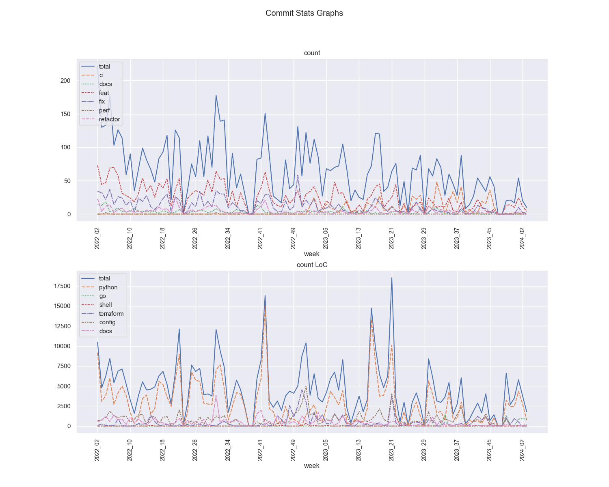

## Key metrics
- Only started dumping data from 2022
- Once a week I scan all repos (public and private) from different version control sources (Github, Gitlab, etc.) and gather specific data, see [projects/01_commit_stats](projects/01_commit_stats.md) for details 
- Column explanations: 
  - Δ 52w means the last year (52 weeks)
  - Δ 13w means last quarter (13 weeks)
  - Δ 1w means the last week

<!-- KEY-METRICS:START -->
Key Metrics dumped @ `2023-08-21T06-53Z`

### Commits

Metric | Total | Δ 52w | Δ 13w | Δ 1w
--- | --- | --- | --- | ---
commit_features | 2385 | 1084 | 198 | 10
commit_fixes | 1174 | 531 | 77 | 5
commit_total | 6206 | 3097 | 673 | 83

- Based on [Angular Commit message guideline](https://github.com/angular/angular/blob/main/CONTRIBUTING.md#-commit-message-guidelines)

### LoC - Lines of Code deleted/added

Metric | Total | Δ 52w | Δ 13w | Δ 1w
--- | --- | --- | --- | ---
config_add | 56231 | 34955 | 9128 | 676
config_del | 19672 | 12230 | 2624 | 730
docs_add | 35121 | 19074 | 2482 | 64
docs_del | 12106 | 5952 | 1288 | 16
go_add | 274 | 0 | 0 | 0
go_del | 99 | 0 | 0 | 0
python_add | 198649 | 107033 | 27829 | 1041
python_del | 74110 | 34614 | 8101 | 604
shell_add | 759 | 661 | 154 | 1
shell_del | 230 | 230 | 63 | 1
terraform_add | 30291 | 24678 | 5702 | 1
terraform_del | 10392 | 9263 | 1626 | 1

- python is for files ending in: ".py",".pyi"
- go is for files ending in: ".go"
- shell is for files ending in: ".sh"
- terraform is for files ending in: ".tf"
- config is for files ending in: ".yml",".yaml",".json",".hcl",".tfvars"
- docs is for files ending in: ".md",".rst"

### Other Metrics

Metric | Total | Δ 52w | Δ 13w | Δ 1w
--- | --- | --- | --- | ---
design_spec | 12 | 6 | 0 | 0
dockerfile | 48 | 15 | 1 | 0
helm_chart | 47 | 18 | 1 | 0
pypi_package | 121 | 35 | 11 | 1
python_package | 46 | 26 | 3 | 0
terraform_module | 83 | 61 | 8 | 0
uml_diagram | 39 | 21 | 0 | 0
<!-- KEY-METRICS:END -->
- `pypi_package` are 3rd party packages used, see list in [requirements.txt](./requirements.txt)
- `python_package` are local packages I have created

## Commit Stats graphs

- where deep_work% > 0