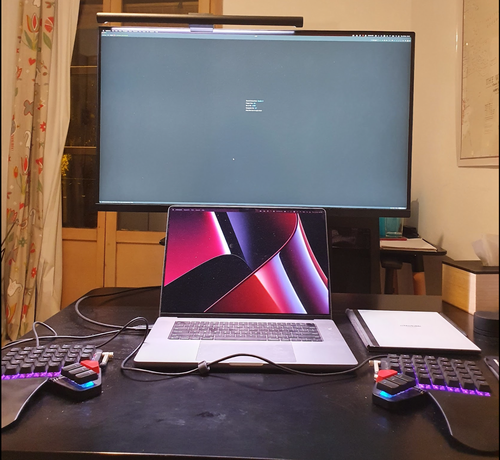

# Developer philosophy and lessons learned
- See also [university.md](00_university.md) for how I got started with programming
- This document is looong, and I try to add a new section every ~6-12 months, feel free to skip ahead

## Year 1: 2017-2018 Kickstart and many things to learn
**Starting in Rocketfarm** proved to be almost precisely as I wished: I got a new project ([wheel.me](https://wheel.me/)) with much responsibility.
I was the leading player in deciding the software architecture and implementation. Furthermore, I got guidance and help from experienced colleagues.
The project had some iterations of a simulator, user interfaces (voice, web, mobile), and backend.
And ended up with the following stack: React with Redux + dialog flow and Alexa, microservices with flask-socketio powered with celery communicating with rabbitmq and hosted on Heroku.

Through the project, I got familiar with everything from designing the build process to designing the user interface, all while keeping weekly meetings with the customer.
After five months of working on this project, I felt that I have the necessary skills to create a product for the web, which is secure, scalable, maintainable, and usable.

The next project was a [smart-house](https://flikk.no/) project with an angular frontend, .net backend, and the [TICK](https://www.influxdata.com/time-series-platform/) stack backed by python and running on Azure.
My focus was on using time series from the sensors to visualize, control, and predict the behavior of the smart-house.
After becoming more experienced with influxdb, I realized that my experiences could help quickstart other developers who wanted to use influxdb.
Therefore, **I created a [quick introduction to influxdb](https://www.udemy.com/master-timeseries-by-using-the-tick-stack-example-by-example/)** and published it on [Udemy](https://www.udemy.com/).

During my first year as a developer, I experienced much frustration with non-code errors and set up time. By having multiple environments (development, staging, production, etc.) and different hosting platforms (Heroku, Azure, AWS), there was a lot of work to set up build systems, set environment variables, packaging the application, and sharing credentials.
<!--TODO: Why we need a build system presentation, Business lessons as a new developer-->
This directed me towards learning about Docker and Kubernetes. Docker-compose made it easy for me to deploy infrastructure and application code in multiple environments. However, I knew it wouldn't scale for production.
However, environment vars now had four different environments: unit test locally, inside docker locally, staging and production containers.
I started to work on a local application powered by [Toga (python GUI)](https://toga.readthedocs.io/en/latest/) with a simple table storage backend.
The application got me introduced to **async programming** in python, but the interface was ugly as hell.

## Year 2: 2018-2019 high hopes for the future
After **a year of working, my mindset changed in two ways.**
> First, I went from __programming to make a living__ to __programming to change the world__.

Programming is not only something I do for work. I love programming, and I think it is my best chance of making the most significant impact in the world.
This changes how many hours I am willing to put in, and my mindset for becoming better.
I try to think like an athlete who is training to go to the Olympics.
Instead of only looking at what skills I need immediately for solving my job, I focus my attention on a specific domain. Moreover,
I cannot be great at many disciplines at the same time.

> Secondly, a new desire to **work remotely**.

As a young person without obligations, this was my chance of exploring the world. My employer was cooperative, and I went to Asia.
I loved the combined productivity and experience-rich lifestyle, and I decided to attempt to make the transition to a full-time traveler.

To be working-remotely challenged my communication skills and tracking abilities. I had a couple of failed meetings due to connectivity issues, and my working times was hard to keep up with for my employer.
Moreover, I was going out of scope on some of the consultant tasks I had.
<!--TODO: Write about how I have lost track of time in the past and done things I was not paid to do. -->
Luckily, I got a new chance, and the second stay led me to switch jobs.
I applied for a role as a web developer in wheel.me, the startup I was consulting for, and they bought me out of my old contract.
I went from being
> **An hourly paid consultant to become a part of a startup, with a contract without office location or office hours and with an improved Norwegian salary**

I was working for the right client at the right time with the right employer. Super lucky.

Working for a startup radically changed how I could continue my journey to become a better developer.
<!--TODO: Write about the advantages/disadvantages of working for a startup/consultant agency-->

#### Python + DevOps = True
Python + DevOps was my area of focus for the 2nd year.
I tried my best to keep my focus away from frontend and hardware.
Luckily, the new job gave me total freedom, and I spent many hours on python and Kubernetes.

I have created a system for how we structure our code, set up infrastructure, deploy applications, document code, and deploy applications.
The system consists of Kops, Helm, Docker, Sphinx, SOPS, and Gitlab.
The purpose is to take away as much of the operational concerns as possible while keeping everything in python.
Moreover, I can sync non-sensitive work code with private code, which benefits both work and my private projects.
Working from a single IDE-workspace makes it possible to stay within the same context and avoid copy-pasting code.

## Year 3: 2019-2020 an ambition to become a zen-developer
As one of the first developers in a startup, I was challenged by **increased responsibility and employee turnover**.
As an attempt to deal with the challenges the best way possible, I came up with the *zen-developer* role model:

> A zen-developer is a calm, productive, and happy developer who is a joy to communicate and work with

The **increased responsibility** came in the form of a promotion from a developer -> tech-lead.
However, after a failed attempt to recruit friends and shape the company values, I ended up *rejecting the promotion*.
I realized the new role would lead me away from developer tasks (which I love) to more management and reporting.
Already, I take my job a bit too seriously, and sometimes I end up working 60-80 hours a week.
I could see this promotion leading down a path of increased stress and burnout.

I always found **employee turnover** to be painful.
This year I saw some great colleagues leaving. I had to realize that this is normal and make an extra effort to be a better communicator.
I am trying to **write and read messages in a positive, clear, and *smiley* way** to make each colleague relationship as friendly as possible.
Furthermore, I do my best to help the company build a supportive culture and hire the most fitted people.

#### Open-source and work-life balance
I have grown into appreciating open-source.
I love learning by reading others' code, and I often spin up the environment to dig into the code.
I also had my [first pull request approved](https://github.com/robinhood/faust/pull/415), and I hope to do many more.

> The zen-developer spends some time *delivering* private projects and has a sustainable work-life balance

I struggle to _deliver_ private projects. The *shiny-new-object-syndrome* and a *high-throughput-idea-stream* make it hard for me to stay focused long enough to "deliver" a project.
However, I am improving, and this year I: created a personal finance application, worked on Spanish-flashcards, wrote blog posts, and created my own python framework for using event streams.

Finally, this year I realized how important it is to have a sustainable work-life balance. I experienced the pressure from tight deadlines and an overwhelming workload.
It helped me to read through Quora's developer questions and have it as a priority to *get-away/detox* from time to time.
I feel blessed to do what I love, and I hope to continue the journey while still having fun and avoiding burnout.

## Year 4: 2020-2021 wannabe team player, library coding, and weekly summaries
I experienced hiring, onboarding, training, and collaborating with new team members this year. That brings up the question: **How to design productive teams and be a good team player?**
One thing is workflows for getting things done; another is building a culture for ongoing improvement and joy.
I found inspiration by reading non-programming books ([A to World without email](https://calnewport.com/a-world-without-email/), [Company of One](https://www.amazon.es/Company-One-Staying-Small-Business/dp/0241470463), [The phoenix project](https://itrevolution.com/product/the-phoenix-project/), [The Infinite game](https://simonsinek.com/books/the-infinite-game/) etc.)
I believe in using written processes, face-to-face contact, status meetings, code reviews, office hours, task boards, checklists, decision-making processes, clear responsibilities, and shared milestones.
As a team member, I aspire to stay reliable, helpful, engaged, clear, calm, and caring. However, sometimes I get deeply focused on my work, and I cannot contribute effectively to the team.

Coding in the same language and working on the same project over time is challenging.
As the project grows, the code risks getting unhealthy.
After a code review and onboarding new members, I needed to step back and make some fundamental changes.
Now I classify the code as a library or app code. I keep all apps independent of each other and reuse the libraries.
Building and maintaining minimal libraries is difficult. Breaking changes leads to new versions, and whether to upgrade old apps is a trade-off.
Breaking changes has almost become a habit, and about every six months, I need to bump the version. One of my packages is now on version 5, which I doubt will be the final version.

I use [pants](https://www.pantsbuild.org/docs) for linting, testing, dependency management, and packaging. Then I have my plugins and scripts for building, publishing, testing, and deploying docker images.
Moreover, I looked at c-extensions, user interfaces, image processing, and memory leaks in Python this year.
Finally, I finished the year by re-visiting [code complete II](https://www.oreilly.com/library/view/code-complete-2nd/0735619670/). I feel happy that the learning journey continues.

How do I learn effectively?
I like to take a long-term perspective and reflect on my current strategy,
long-term I want to have the skills to realize an idea into a product that scales unlimited. This pushes me in the direction of [DIY](https://en.wikipedia.org/wiki/Do_it_yourself), instead of using [OSS](https://en.wikipedia.org/wiki/Open-source_software) or pre-built tools.
However, sometimes I experience the truth of seeing that someone else has already built the same thing, only better. This is usually humbling and a great way of digging in and understanding the other solution.

I started the habit of doing weekly summaries. I spend about 30 min on setting goals, tracking metrics, and writing notes on everything from work hours to blood tests to social life.
Furthermore, I spend a few hours quarterly to set goals, choose projects and reflect. I got inspiration from [Cal Newport](https://www.calnewport.com/)). 
Weekly summaries help me to see progress, stay focused, and live a balanced life.
<!--end 24 July 2021-->

## Year 5: 2021-2022 workflows and upcoming graduation?
<!--start 20 March 2022-->
This year I have formalized how I go from an idea to production code: Workflows.
I follow a checklist of workflows. 
I am starting with a [spec](https://www.joelonsoftware.com/2000/10/02/painless-functional-specifications-part-1-why-bother/) and developing a design on paper before touching the keyboard.
Using a spec has helped me to get more feedback as I try to "submit" it before starting the implementation.
As I don't need a keyboard, I like going to my _thinking office_ to write on paper ([reMarkable](https://remarkable.com)).
The thinking office allows for more creativity and can be a hammock, a rocking chair, a sofa, etc.,
Then back to the computer to continue the workflow:
- design the public api
- implement it with unit testing
- run build files generation
- create and run integration tests
- run across the repo: formatting, linting, and a full test suite
- deployment

I have created my own `run_workflow.py` or `pants` script for help, and I see the benefit of sticking to a process.
That way, I avoid context-switching between the different mindsets: design, implementation and testing, debugging, and deploying.
Starting with the public api makes it easier to make changes early and avoids jumping between abstraction levels.

The workflows come in handy for teamwork. More members require more professionalism and communication.
Having worked mostly on my own, this is my biggest challenge. 
Delegating at the right level, follow-up at the proper intervals, and understanding other teams' problems are critical for company success.
I can see myself improving a lot here, and some days I wish to go back to the small company start. 
However, seeing the company grow and hearing stories from friends, I appreciate all the other people not directly writing code.
I aspire to talk to more people and keep the relationships professional.

After five years, it was time for a hardware upgrade. This year I acquired a new MacBookPro, a new [Moonlander split keyboard](https://www.zsa.io/moonlander/), and a 32-inch monitor.

<!--end 20 March 2022-->
<!--start 12 Oct 2022-->
Driven by curiosity, the need to fork, and a lack of debugging skills, I started learning Golang and reading about how kubernetes works under the hood.
I was impressed by how little time it takes to have the basic knowledge for reading and making edits in a new language.
Spending a weekend learning the gist of a language is something I'll do again as it makes it more fun to "dig in" and explore the code of the tools I'm using.

Approaching the end of 5 years, I started setting a private goal of "graduation."
"Graduation" means having "hands-on" experience for a list of subjects I have deemed important (building and running multiple microservices, authentication and authorization implementations, alerting pipelines with crash reports for debugging, dashboards with SLI and error budget, release pipeline, backup and restore procedures, ci-pipelines, and cloud cost management)
A funny coincidence that I'm _graduating_ after five years of working, the same five years I used to graduate from university.
By no means is this the final _graduation_, but I feel like I have intermediate experience and skills to transform an idea into a product.
<!-- end 12 Oct 2022-->

## Year 6: 2022-2023 reality check
<!-- start 11 Aug 2023-->
As wheel.me have continued to grow, so has the team.
I have continued my journey to stay technical and avoid management responsibility.
Therefore, having a boss come and lead me to make changes has been good.
Moreover, working in a bigger team and with big clients forces simplicity and compliance.
I have had to kill many of my custom "code babies."
It can hurt when giving it up, but afterward, you feel lighter.
However, communicating changes _nicely_ is essential
I'm doing my best to understand others' concerns and code. 
I don't want to use a negative tone or be unnecessarily harsh when giving and receiving feedback. 

Although it has been over three years since I started listening to [the Deep Questions](https://www.thedeeplife.com/) podcast, I still get surprised about how much I can improve my productivity.
It is easy to get into "responsive" mode on Slack and let context switches happen hourly.
Being aware of this, I try to use the "focus" mode on my Mac and work without distractions for 45-90 min intervals.

This year I started freelancing. I still work for wheel.me, but since I'm getting established in Spain, I can't have a Norwegian contract anymore.
I like tracking my time, and I have been lucky to have continued flexibility from wheel.me, which made the transition to freelancer easy.
The upside to freelancing is being free to choose when to take time off (not having to worry about limits), paid for every hour, and possibly be involved in other projects, 
The downside is all the paperwork and feeling more _disposable_

Meeting other developers at [PyCamp](https://pycamp.es/) was inspiring, and I hope to attend more meetups soon.
I started publishing my projects to [Github](https://github.com/EspenAlbert) and working more on open source.

<!-- end 11 Aug 2023-->
